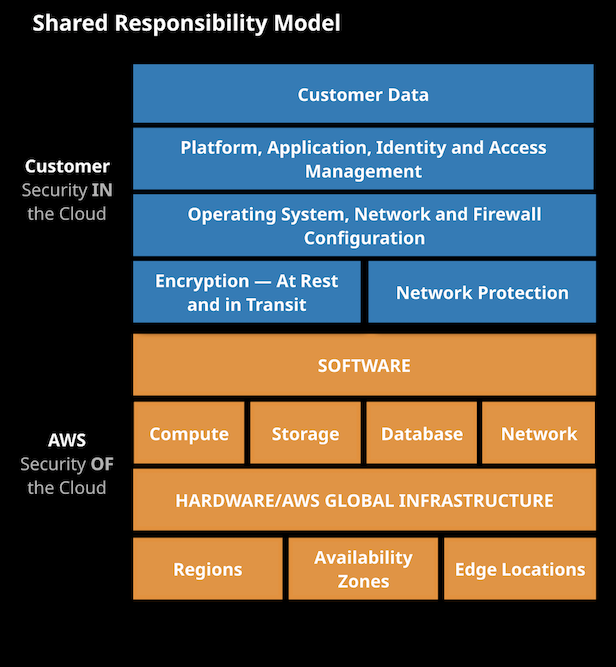

# General Architecture Fundamentals

## 1.Shared Responsibility/Security Model

The security and compliance of AWS platform is partially managed by AWS, and some parts are the customer's responsibility.

#### 1. AWS responsibility

The AWS responsibility is "Security of the cloud", meaning infrastructure that runs all the services offered in the AWS cloud. For example, AWS regions, Availability zones, Edge locations etc.

#### 2. Customer Responsibility "Security in the cloud"

The customer responsibility is "Security in the cloud", meaning anythings that's inside the cloud is managed by the customer. For example, data inside the cloud, IAM tools to apply the appropriate permissions,Operating System, Network and Firewall Configuration, Encryption at Rest and in-transit etc.

#### Shared controls

Controls which apply to both the infrastructure layer and customer layers, but in completely separate contexts or perspectives. In a shared control, AWS provides the requirements for the infrastructure and the customer must provide their own control implementation within their use of AWS services. Examples include:

Patch Management – AWS is responsible for patching and fixing flaws within the infrastructure, but customers are responsible for patching their guest OS and applications.

Configuration Management – AWS maintains the configuration of its infrastructure devices, but a customer is responsible for configuring their own guest operating systems, databases, and applications.

Awareness & Training - AWS trains AWS employees, but a customer must train their own employees.

## 2.Types of clouds

The three main cloud com

Links to AWS official site:
1. [Shared Responsibility Model](https://aws.amazon.com/compliance/shared-responsibility-model/)
2. [Types of Clouds](https://aws.amazon.com/types-of-cloud-computing/)